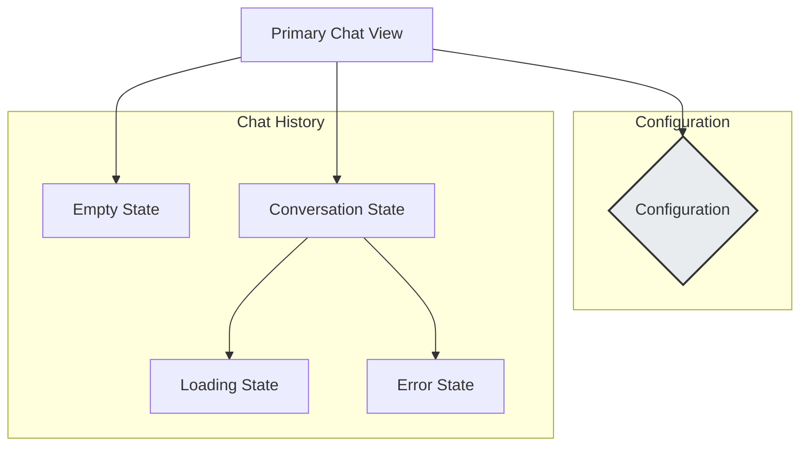
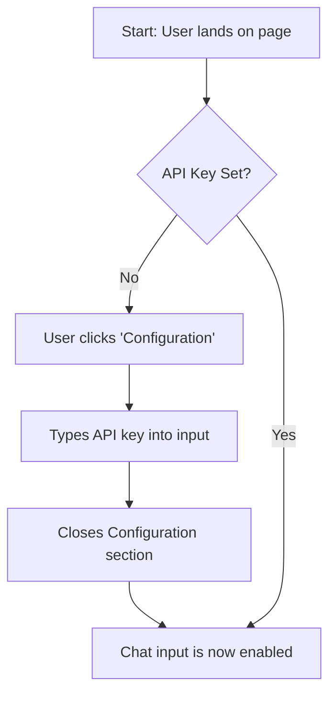
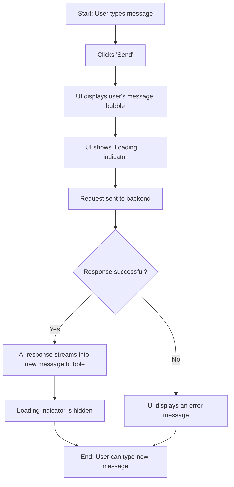

# AI Engineer Challenge UI/UX Specification

## Section 1: Introduction

### 1.1 Document Purpose
This document defines the user experience goals, information architecture, user flows, and visual design specifications for the **AI Engineer Challenge** chat application's user interface. It serves as the foundation for visual design and frontend development, ensuring a cohesive and user-centered experience based on the **"Focused & Professional"** design concept.

### 1.2 Overall UX Goals & Principles

#### Target User Personas
* **Primary: The Professional Developer**: A user building AI-powered features who requires a reliable, efficient, and clutter-free tool. Their goal is to get accurate results quickly and integrate them into their workflow.
* **Secondary: The Creative Explorer**: A user (technical or not) who is experimenting with AI capabilities. They value ease of use, clear guidance, and an interface that feels modern and engaging.

#### Usability Goals
* **Intuitive Clarity**: The interface should be immediately understandable, requiring zero tutorial.
* **Frictionless Start**: A new user should be able to configure their API key and send their first successful query in under 60 seconds.
* **Polished Professionalism**: The UI's look and feel should inspire confidence and trust in the tool's capabilities.

#### Design Principles
1.  **Focus Above All**: The primary interface must be free of clutter, directing the user's attention entirely to the conversation.
    * *Example: The main chat view is the largest element, and the input bar is always present.*
2.  **Progressive Disclosure**: Hide complexity by default. Advanced or secondary options should be revealed only when the user explicitly requests them.
    * *Example: The API key and Model settings are hidden by default in a collapsible "Configuration" section.*
3.  **Clarity Through Contrast**: Use color and space to create a clear visual hierarchy that is both aesthetically pleasing and highly readable.
    * *Example: User and Assistant messages have distinct background colors and alignment to be easily distinguishable.*
4.  **Immediate Feedback**: Every user action, from typing to sending a message, should have a clear and immediate system response.
    * *Example: A loading indicator appears instantly after a message is sent.*

---
## Section 2: Information Architecture (IA)

### 2.1 Screen State Inventory
The application consists of a single primary screen with several key states that define the user's experience.



* **Primary Chat View**: The main container for the entire application.
* **Configuration**: A collapsible view for secondary settings (API Key, Model).
* **Empty State**: The initial view of the chat history before a conversation starts.
* **Conversation State**: The view when messages are present.
* **Loading/Error States**: Temporary states within the conversation view to provide user feedback.

### 2.2 Navigation Structure
* **Primary Navigation**: As a single-page application, there is no traditional primary navigation menu (e.g., a navbar with multiple links). All interactions occur within the context of the main chat view.
* **Secondary Navigation & Breadcrumbs**: Not applicable for this focused, single-view design. The user's context is always clear, eliminating the need for hierarchical navigation aids.

---
## Section 3: User Flows

### 3.1 Flow 1: Configuring the Session
* **User Goal**: To securely input their API key to enable chat functionality.
* **Entry Points**: Landing on the application for the first time or needing to change the key.
* **Success Criteria**: The chat input becomes enabled after a valid key is entered.

#### Flow Diagram


#### Edge Cases & Error Handling
* An invalid API key will only be detected upon the first API call, not on input. The system must display a clear error message in this case.

### 3.2 Flow 2: Conducting a Conversation
* **User Goal**: To ask the AI a question and receive a complete, streamed response.
* **Entry Points**: The main chat interface, after the API key has been set.
* **Success Criteria**: The user's question is displayed, and the AI's full response is streamed into the chat view.

#### Flow Diagram

#### Edge Cases & Error Handling
* **Empty Input**: The "Send" button should be disabled if the text input is empty to prevent blank submissions.
* **Network/API Error**: If the backend call fails, the loading indicator should be replaced with a user-friendly error message.

---
## Section 4: Wireframes & Mockups

### 4.1 Primary Design Files
For this project, this UI/UX Specification document will serve as the primary design reference. Visual prototypes will be generated on-demand using AI UI tools based on the prompts and specifications contained herein.

### 4.2 Key Screen Layout: Main Chat View
The application uses a single screen, which follows the "Top-Down Focused Layout" principle.

#### Conceptual Wireframe

```text
+------------------------------------------------------+
| Header: [AI Chat Title]                              |
+------------------------------------------------------+
| ▼ Configuration (Collapsed by default)               |
+------------------------------------------------------+
|                                                      |
|  Chat History Area                                   |
|  (Scrollable, takes up remaining space)              |
|                                                      |
|  [Assistant Message Bubble]                          |
|                                                      |
|                                     [User Message]   |
|                                                      |
|                                                      |
+------------------------------------------------------+
| [ Floating Input Bar with Text Area and Send Button ]|
+------------------------------------------------------+
```

#### Key Elements & Interaction Notes
* **Header**: Contains only the application title.
* **Configuration Section**: A collapsible container, hidden by default.
* **Chat History Area**: A scrollable area that vertically stacks message bubbles.
* **Floating Input Bar**: Fixed or "sticky" at the bottom of the viewport.

---
## Section 5: Component Library / Design System

### 5.1 Design System Approach
For this project, we will establish a custom, project-specific micro design system. The core components will be built from scratch using Next.js and styled with Tailwind CSS, adhering to the visual rules of the "Focused & Professional" theme.

### 5.2 Core Components
* **Button**: For all primary actions. Variants: `Primary` (solid teal), `Secondary` (outline). States: `Default`, `Hover`, `Active/Pressed`, `Disabled`.
* **Input**: For all text entry. Variants: `Text`, `Password`. States: `Default`, `Focus` (with a teal accent border), `Error`.
* **CollapsibleSection**: A container for progressive disclosure. States: `Collapsed`, `Expanded`.
* **MessageBubble**: To display individual chat messages. Variants: `User` (teal, right-aligned), `Assistant` (light gray, left-aligned).

---
## Section 6: Branding & Style Guide

### 6.1 Visual Identity
This document establishes the visual identity for the project.

### 6.2 Color Palette
| Color Type | Hex Code | Usage |
| :--- | :--- | :--- |
| **Background** | `#F8F9FA` | Main app background color. |
| **Container** | `#FFFFFF` | Background for cards and containers. |
| **Border** | `#E9ECEF` | Subtle borders and dividers. |
| **Text** | `#212529` | Primary text color for high readability. |
| **Primary Accent**| `#00796B` | Buttons, user messages, links, and focus indicators. |
| **Success** | `#28A745` | Success notifications and confirmations. |
| **Warning** | `#FFC107` | Non-critical warnings or alerts. |
| **Error** | `#DC3545` | Error messages and destructive action confirmations. |

### 6.3 Typography
* **Font Family**: A system font stack will be used.
    * **Primary**: `system-ui, -apple-system, BlinkMacSystemFont, "Segoe UI", Roboto, "Helvetica Neue", Arial, sans-serif`
    * **Monospace**: `ui-monospace, SFMono-Regular, Menlo, Monaco, Consolas, "Liberation Mono", "Courier New", monospace`
* **Type Scale**:
| Element | Size | Weight | Line Height |
| :--- | :--- | :--- | :--- |
| **H1 (Title)** | `24px` | `700` (Bold) | `1.2` |
| **H2 (Section)**| `20px` | `600` (Semi-Bold)| `1.3` |
| **Body** | `16px` | `400` (Regular) | `1.5` |
| **Small** | `14px` | `400` (Regular) | `1.5` |

### 6.4 Iconography
* **Icon Library**: **Heroicons** (`@heroicons/react`).
* **Usage Guidelines**: The **Outline** style of icons should be used by default.

### 6.5 Spacing & Layout
* **Spacing Scale**: A consistent, 4-pixel based scale will be used (`4px`, `8px`, `12px`, `16px`, `24px`, `32px`).

---
## Section 7: Accessibility Requirements

### 7.1 Compliance Target
* **Standard**: **Web Content Accessibility Guidelines (WCAG) 2.1 Level AA** compliance.

### 7.2 Key Requirements
* **Visual**: Ensure 4.5:1 color contrast; provide clear focus indicators.
* **Interaction**: Ensure full keyboard navigation and screen reader support.
* **Content**: Use semantic HTML and provide labels for all form inputs.

### 7.3 Testing Strategy
Validation will be done via automated tools (e.g., Axe) and manual keyboard/screen reader testing.

---
## Section 8: Responsiveness Strategy

### 8.1 Breakpoints
| Breakpoint | Min Width | Target Devices |
| :--- | :--- | :--- |
| **Mobile (Default)** | `0px` | Phones |
| **Tablet** | `768px` | Tablets, small laptops |
| **Desktop** | `1024px`| Desktops |

### 8.2 Adaptation Patterns
* **Layout**: The single-column layout will be maintained, with containers using full width on mobile.
* **Typography**: Font sizes will be slightly reduced on smaller screens.
* **Touch Targets**: Interactive elements will have a minimum `44x44` pixel size on mobile.

---
## Section 9: Animation & Micro-interactions

### 9.1 Motion Principles
* **Purposeful**: Animations should provide feedback or guide the user.
* **Quick & Subtle**: Durations should be between 150ms - 300ms.
* **Consistent**: Use consistent easing for similar interactions.

### 9.2 Key Animations
* **Message Bubble Appearance**: New messages will fade and slide into view.
* **Button Feedback**: Buttons will have a subtle scale effect on press.
* **Configuration Section**: The section will have a smooth expand/collapse transition.

---
## Section 10: Performance Considerations

### 10.1 Performance Goals
* **Page Load**: Largest Contentful Paint (LCP) under **2.5 seconds**.
* **Interaction Response**: Interaction to Next Paint (INP) under **100 milliseconds**.
* **Animation Smoothness**: Maintain **60 frames per second (FPS)**.

### 10.2 Design Strategies
* **Minimal Dependencies**: Use a custom micro component library.
* **Code Splitting**: Leverage Next.js for automatic code splitting.
* **Optimized Assets**: Ensure all assets are optimized for web delivery.

---
## Section 11: Next Steps

### 11.1 Immediate Actions
1.  **Final Review**: You (the user) provide final approval for this UI/UX Specification document.
2.  **Handoff to Architect**: This completed document will be handed over to the **Architect** agent.
3.  **Architecture Creation**: The Architect will use this specification to create the detailed `front-end-architecture.md`.

### 11.2 Design Handoff Checklist
- [x] All user flows documented
- [x] Core component inventory complete
- [x] Accessibility requirements defined
- [x] Responsive strategy clear
- [x] Brand guidelines and style guide incorporated
- [x] Performance goals established